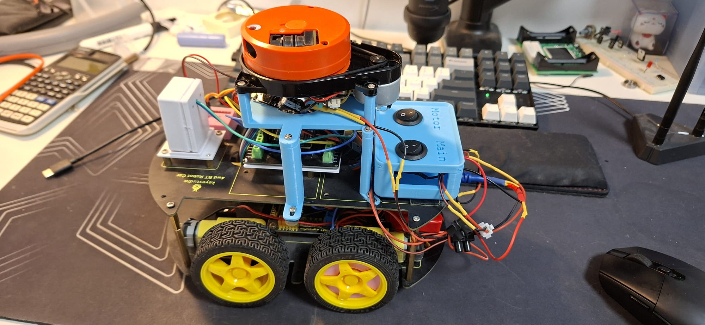
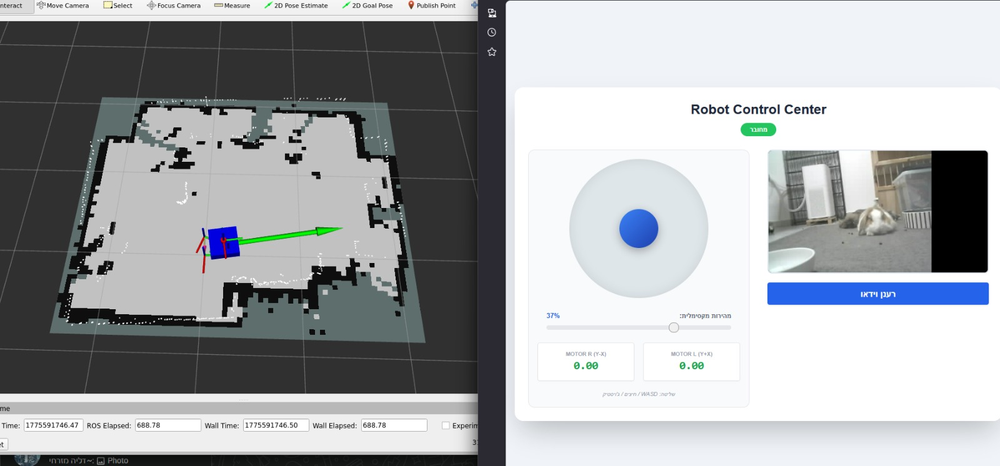

# Autonomous Robot Bridge & EKF Integration (ROS 2)

This project implements a robust communication and estimation layer for a differential drive robot using **ESP32**, **ROS 2 (Humble)**, and a **LiDAR Delta-2G**. The system features a distributed multi-MCU architecture for high-speed sensor data processing and real-time visualization.

## 📸 Media & Demos

### Hardware Overview

*The physical robot assembly featuring the LiDAR sensor, main gateway, and Pocophone processing unit.*

### Mapping & Control

*Real-time SLAM Toolbox occupancy grid and EKF-stabilized odometry visualized in RViz2.*

### Operation Videos
| Robot in Action | System Telemetry (PC View) |
| :---: | :---: |
|  |  |
| *Physical movement and environment interaction.* | *ROS 2 topics, TF tree, and map updates.* |

---

## 🛠 System Architecture
The system is designed with a modular approach to separate hardware abstraction from high-level navigation.

### Distributed Multi-MCU Gateway
To optimize processing power and minimize latency, the robot utilizes three dedicated ESP32 units communicating through a central hub:
- **Sub-system A (LiDAR Node):** Dedicated to high-frequency sampling and buffering of the Xiaomi Delta-2G LiDAR data.
- **Sub-system B (Vision Node):** ESP32-CAM module handling real-time video stream (UDP/HTTP).
- **Main Gateway (Comm Hub):** Aggregates data from sub-systems, processes IMU/Encoder feedback, and maintains the UDP link with the ROS 2 host.

## 🚀 Key Technical Features
- **Sensor Fusion (EKF):** Integrated wheel encoders (linear velocity) with IMU (angular velocity) using `robot_localization` to eliminate mechanical drift and handle slippage.
- **Time Synchronization:** Implemented `odom_offset` logic to align ESP32 internal clock with ROS 2 system time, ensuring accurate laser-scan transforms.
- **Asynchronous SLAM:** Optimized `SLAM Toolbox` parameters for real-time map updates on a mobile base.
- **Stability:** Robust UDP socket management with port reuse and deadzone filtering for IMU noise.

## 📊 Data Flow
1. **LiDAR Node** → (Serial/I2C) → **Main Gateway** → (UDP 8888) → `lidar_bridge` → `/scan`
2. **Vision Node** → (UDP/HTTP) → `video_stream_node` → `/camera/image_raw`
3. **Encoders/IMU** → **Main Gateway** → (UDP 8888) → `motor_bridge` → `/odom` & `/imu/data`
4. **EKF Node** → Sensor Fusion → `TF: odom -> base_link`
5. **SLAM Toolbox** → Map Generation → `TF: map -> odom`

### ⚡ Electrical Power Architecture
The system is powered by a high-capacity **Power Bank**, providing a stable and protected energy source for the entire cluster:

- **Power Rails:** Dual-bus distribution separating **Actuator Power** from **Logic Power** to mitigate EMI.
- **Voltage Regulation:** High-efficiency buck converters maintain a constant 5V/3.3V rail for the ESP32 units, ensuring consistent performance even as the Power Bank discharges.
- **Enhanced Wiring:** Custom low-resistance power cabling and bulk capacitors integrated to prevent voltage drops during high-torque motor maneuvers.

### 🛑 Safety & Fail-safe Mechanisms (Watchdog)
As a critical safety feature for autonomous operation:
- **Communication Timeout:** The Main Gateway implements a **Software Watchdog**. If no command is received from the ROS 2 host within 500ms, the robot immediately enters a **Safety-Stop** state, cutting power to the motors.
- **Hardware Protection:** Leveraging the Power Bank's built-in over-current and short-circuit protection for robust field operation.

### 📏 Custom Hardware Integration
- **DIY Encoders:** Designed and calibrated custom optical/magnetic encoders for real-time wheel odometry, providing the pulse-count necessary for the EKF velocity estimation.
- **Physical Integration:** Modular mounting system for all three ESP32 nodes and the LiDAR, ensuring structural rigidity and optimal sensor alignment.